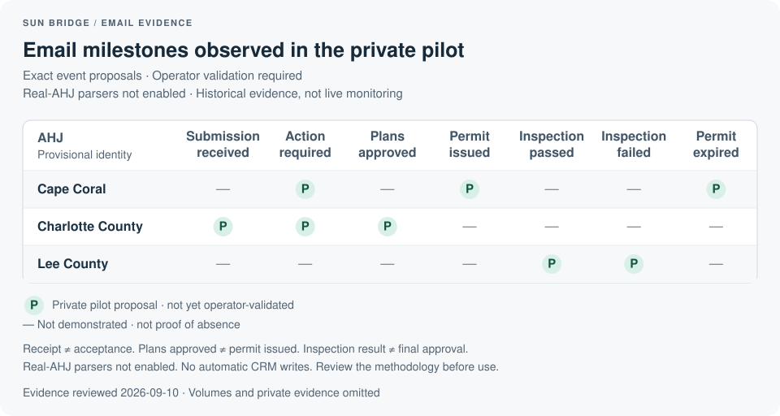

# Sun Bridge

Open-source jurisdiction and utility data, historical solar timelines, and permitting inbox review.

Find the organizations involved in a solar project, compare source-reported timelines and requirements, reconcile them with your own records, and review permitting emails against the right project. Keep the supporting evidence and the decisions in your team's hands.

## Start with useful public data

The bundled SolarTRACE snapshot provides **11,662 identified AHJs, 1,004 identified utilities, and 28,455 historical timeline benchmarks**. Additional unresolved source entries remain clearly marked for review; this is not a complete national registry.

You need Python 3.10 or newer. No extra Python packages, account, API key, or network connection are needed to initialize the bundled catalog.

```sh
git clone https://github.com/kyomi44/sun-bridge.git
cd sun-bridge
python3 -m sunbridge catalog init
python3 -m sunbridge catalog search --state FL --kind building_department --query "Cape Coral"
```

Cloning downloads the repository; catalog commands then work locally. You can also download the repository ZIP and open a terminal in the extracted folder. On Windows, use `py -3` if `python3` is unavailable. Run from the checkout; a standalone installed-package distribution is not supported yet.

Initialization loads the bundled public SolarTRACE data into `private/catalog/sunbridge.sqlite`. Search results supply IDs you can inspect:

```sh
python3 -m sunbridge catalog show --id ENTITY_ID
python3 -m sunbridge catalog export --state FL --output private/catalog-export
```

Replace `ENTITY_ID` with an ID from search. Export produces `organizations.json`, `benchmarks.json`, `requirements.json`, `source.json`, and `NOTICE.txt` for your own analysis or deliberately mapped CRM import. Preserve the source notice with redistributed source-derived data. Export does not change a CRM.

**Historical benchmarks are not promised turnaround times.** The source reports median business-day timelines for 2017–2024 installation cohorts, not current permit statuses or service-level commitments. Recheck requirements against current official instructions. Submission methods do not establish how status notifications arrive. Read the [source and methodology notes](docs/solartrace-sources.md) before using the data.

## Connect the catalog to your operations

Prepare a private organization export, then review candidate links to the public catalog:

```sh
python3 -m sunbridge catalog reconcile --organizations private/organizations.json --output private/catalog-reconciliation
```

Reconciliation proposes links for review; it does not establish jurisdiction boundaries, transfer legal authority, or update organizations automatically. The [getting-started guide](docs/getting-started.md) includes the organization input format; the [catalog guide](docs/catalog.md) covers lookup, export, and evidence attachment.

| Available capability | Use it for |
| --- | --- |
| Local public catalog | Search AHJs and utilities; inspect historical benchmarks and source-reported requirements; export selected data. |
| Organization reconciliation | Review proposed links between your records and catalog entities. |
| Email review | Import local EML/MBOX samples and review proposed submission, correction, issuance, and inspection events. |
| CRM records | Supply normalized JSON or read explicitly selected Pipedrive deals with account-specific mappings. |
| Optional model extraction | Evaluate subject/body interpretation through an explicitly authorized OpenAI-compatible endpoint. |
| Private reports | Inspect source text, event scope, match candidates, duplicates, and import issues in HTML, Markdown, or JSON. |

## Which AHJs send useful milestone updates?

Browse the [email coverage charts](docs/email-coverage.md) to find candidate AHJs and see which specific milestones have private pilot evidence. The public view uses presence-only marks, with no email volumes or customer data.



Pilot-observed milestones are experimental proposals requiring human review, not validated CRM updates. The broader candidate chart shows subject-level signals only; a blank means not demonstrated, not unsupported. Read the [evidence and contribution guide](docs/email-coverage-methodology.md) before relying on or extending a mark.

## Review a permitting inbox sample

Try the complete review flow with fictional messages and permit records:

```sh
python3 -m sunbridge start --open
```

The local report opens in your browser; no account is connected and no model is called. For your own data, use `setup --interactive`, check the configuration with `doctor`, and follow the [email and CRM setup guide](docs/getting-started.md). A customer name alone never establishes a permit match. Receipt, approval, issuance, inspections, and utility permission remain separate events.

Use `catalog attach-review` with explicitly verified profile-to-catalog links to retain proposed email evidence locally. This does not convert a proposal into a confirmed status or rewrite historical benchmarks.

Pipedrive is the first native read adapter. Other CRMs can use the normalized JSON contract; planned adapters are not working connectors. See the [CRM support matrix](docs/crm-integrations.md) and [optional model setup](docs/llm-providers.md).

This is review-only software. There are no CRM writes, live inbox subscriptions, scheduled monitors, saved approval controls, utility account connectors, or autonomous permit approvals. Real AHJ rule parsers remain disabled until privately validated; catalog coverage does not imply parser coverage. Optional model results always require review and no provider/model is live-certified.

## Improve the shared data and workflows

Contribute a dated official source, a corrected organization identity, a better source mapping, a synthetic parser case, or a tested read adapter. Keep original source identifiers, reporting periods, unknowns, and privacy boundaries intact. See [CONTRIBUTING.md](CONTRIBUTING.md) and the [roadmap](docs/roadmap.md).

```sh
python3 -m sunbridge validate
python3 -m unittest discover -s tests -v
```

Never publish real inbox archives, customer records, CRM exports, credentials, or private reports. Follow the [data handling guide](docs/data-handling.md); third-party public datasets retain their own terms.

## Our mission

Empower people to understand, supervise, and improve increasingly automated work. Operators retain judgment over evidence and exceptions; accessible documentation and [practical exercises](docs/learning-path.md) help teams build the skills to maintain their systems. The [charter](CHARTER.md) and [governance](GOVERNANCE.md) make that commitment part of how the project is run.

Original code and documentation are [MIT-licensed](LICENSE).
