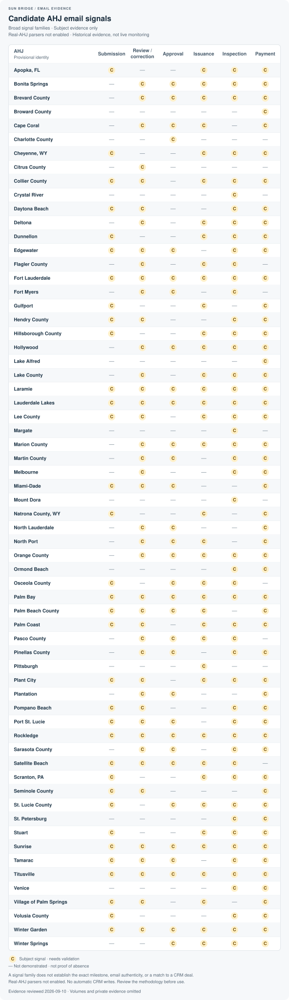

# AHJ email milestone signals

A public map of email signals that may support reviewable CRM updates. It reports milestone presence, never inbox volumes, customer records, or matching results.

**These are evidence levels, not production support claims.** AHJ identities remain provisional. Real-AHJ parsers are not enabled by this registry, and no automatic CRM writes are added.

[How to interpret and contribute](email-coverage-methodology.md) · [Public registry](../coverage/ahj-email-signals.json)

## Exact milestones observed in the private pilot

**P** = an exact milestone was proposed in a historical, private, review-only pilot. It still needs operator validation. **—** = not demonstrated; it does not mean unavailable.

| AHJ | Submission received | Action required | Plans approved | Permit issued | Inspection passed | Inspection failed | Permit expired |
| --- | --- | --- | --- | --- | --- | --- | --- |
| Cape Coral | — | P | — | P | — | — | P |
| Charlotte County | P | P | P | — | — | — | — |
| Lee County | — | — | — | — | P | P | — |

Submission received does not mean accepted. Approved plans do not mean permit issued. An inspection result does not mean final approval. Action required is not a terminal denial.

## Candidate email signal families

**C** = a subject-level signal family was observed and needs validation. A candidate mark is not a confirmed event, a complete lifecycle, or an implemented parser. **—** = not demonstrated in the reviewed evidence.

Accessible candidate signal table and identity-review notes

| AHJ | Submission | Review / correction | Approval | Issuance | Inspection | Payment | Identity review |
| --- | --- | --- | --- | --- | --- | --- | --- |
| Apopka, FL | C | — | — | C | C | C | Provisional identity |
| Bonita Springs | — | C | C | C | C | C | Provisional identity |
| Brevard County | — | C | C | C | C | C | Provisional identity |
| Broward County | — | — | — | — | — | C | Provisional identity |
| Cape Coral | — | C | C | C | — | C | Provisional identity |
| Charlotte County | — | — | C | — | — | — | Provisional identity |
| Cheyenne, WY | C | — | — | C | C | C | Provisional identity |
| Citrus County | — | C | — | — | — | — | Provisional identity |
| Collier County | C | C | — | C | C | C | Historical domain aliases grouped; identity needs confirmation |
| Crystal River | — | — | — | — | C | — | Provisional identity |
| Daytona Beach | C | C | — | — | C | C | Provisional identity |
| Deltona | — | C | — | C | C | C | Provisional identity |
| Dunnellon | C | — | — | C | C | C | Sender spelling variant grouped; identity needs confirmation |
| Edgewater | C | C | C | — | C | C | Provisional identity |
| Flagler County | — | C | — | C | C | — | Provisional identity |
| Fort Lauderdale | C | C | C | C | C | C | Provisional identity |
| Fort Myers | — | C | C | — | C | — | Provisional identity |
| Gulfport | C | — | — | C | — | C | Provisional identity |
| Hendry County | C | C | — | — | C | C | Provisional office grouping; jurisdiction needs confirmation |
| Hillsborough County | C | — | — | C | C | C | Provisional identity |
| Hollywood | — | C | C | C | C | C | Provisional identity |
| Lake Alfred | — | — | — | — | — | C | Provisional identity |
| Lake County | — | C | — | C | C | C | Provisional identity |
| Laramie | C | C | C | C | C | C | Provisional identity |
| Lauderdale Lakes | C | C | C | C | C | C | Cross-platform identity grouped; identity needs confirmation |
| Lee County | C | C | — | C | C | C | Provisional identity |
| Margate | — | — | — | — | C | — | Provisional identity |
| Marion County | — | C | C | C | C | C | Historical domain aliases grouped; identity needs confirmation |
| Martin County | — | C | C | — | C | C | Provisional identity |
| Melbourne | — | C | — | — | C | C | Provisional identity |
| Miami\-Dade | C | C | C | — | — | C | Provisional identity |
| Mount Dora | — | — | — | — | C | — | Provisional identity |
| Natrona County, WY | C | — | — | C | — | C | Provisional identity |
| North Lauderdale | — | C | C | — | — | C | Unusual domain alias grouped; identity needs confirmation |
| North Port | — | C | C | C | — | C | Provisional identity |
| Orange County | — | C | C | C | C | C | Provisional identity |
| Ormond Beach | — | — | — | — | C | C | Provisional identity |
| Osceola County | C | — | C | C | C | — | Provisional identity |
| Palm Bay | C | C | C | C | C | C | Historical domain aliases grouped; identity needs confirmation |
| Palm Beach County | C | C | C | C | — | C | Provisional identity |
| Palm Coast | C | C | — | C | C | C | Provisional identity |
| Pasco County | — | C | C | C | C | — | Provisional identity |
| Pinellas County | — | C | C | — | C | C | Provisional identity |
| Pittsburgh | — | — | — | C | — | — | Provisional identity |
| Plant City | C | C | — | C | C | C | Provisional identity |
| Plantation | — | C | C | — | — | C | Provisional identity |
| Pompano Beach | C | C | — | — | C | C | Provisional identity |
| Port St\. Lucie | C | C | C | — | C | C | Provisional identity |
| Rockledge | C | C | C | C | C | C | Provisional identity |
| Sarasota County | — | C | C | — | C | C | Provisional identity |
| Satellite Beach | C | C | C | C | C | — | Provisional identity |
| Scranton, PA | C | — | — | C | C | C | Provisional identity |
| Seminole County | C | C | — | — | — | C | Provisional identity |
| St\. Lucie County | C | — | C | C | C | C | Provisional identity |
| St\. Petersburg | — | — | — | — | C | C | Provisional identity |
| Stuart | C | — | — | C | C | C | Provisional identity |
| Sunrise | C | C | C | C | C | C | Provisional identity |
| Tamarac | C | C | C | — | C | C | Provisional identity |
| Titusville | C | C | C | C | C | C | Provisional identity |
| Venice | — | — | — | — | C | C | Provisional identity |
| Village of Palm Springs | C | C | — | C | — | C | Provisional identity |
| Volusia County | C | — | — | — | C | C | Provisional identity |
| Winter Garden | C | C | C | C | C | C | Provisional identity |
| Winter Springs | — | — | C | C | C | C | Provisional identity |

## Before a CRM update

Validate the message body and source, distinguish the exact milestone, confirm the AHJ and permit/deal identity, handle duplicates and older messages, and require human review. Current status must not be inferred from historical email alone.

Only AHJ names, qualitative milestone flags, and identity-review categories are published. The chart contains no email addresses, subjects, permit identifiers, customer data, message counts, match counts, or private evidence links.

Evidence reviewed: 2026-09-10. Historical private review; not live monitoring or a claim of ongoing availability.

Generated from the public registry with `python3 scripts/render_email_coverage.py`. This rendering step does not open an inbox or private analysis.
